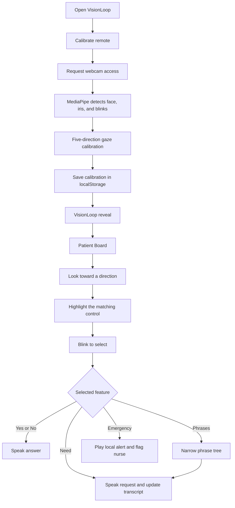

# VisionLoop

**Communicate with your eyes.**

VisionLoop is a webcam-based assistive communication prototype for patients who cannot easily speak or reach a call button. MediaPipe face and iris tracking turns gaze and blinks into on-screen selections without dedicated eye-tracking hardware, while every control remains usable with touch, mouse, or keyboard.

Built by **Team Barbie** for **VinHack 2026**.

Built for VINHACK 2026, VisionLoop finished as a Top 10 project.

## What's in this repository?

| Application | Location | Purpose |
| --- | --- | --- |
| **VisionLoop** | `web/` | React app with the Patient Board and Phrases |
| **Standalone trainer** | Root (`src/`) | Standalone aim trainer with calibration, diagnostics, and blink or dwell firing |
| **Python tracker** | `main.py`, `eye_tracking/` | Desktop webcam demo with tracking overlays |

## How the main app works

The primary VisionLoop application lives in `web/`. Its high-level flow is:



`web/src/App.tsx` controls the intro, calibration, logo reveal, and board flow. `web/src/hooks/useEyeTracker.ts` processes the webcam and MediaPipe output, `web/src/components/EyeRemote.tsx` converts gaze and blinks into navigation, and `web/src/components/NeedsBoard.tsx` provides the patient communication interface.

## Quick start: VisionLoop

You need Node.js **22.12 or newer**, npm, a webcam, and a browser with camera access. An internet connection is needed to load the MediaPipe runtime and model.

Clone the repository, then start the web app:

```bash
git clone https://github.com/Team-Barbie/vinhack-26.git
cd vinhack-26
cd web
npm install
npm run dev
```

Open the local URL printed by Vite and allow camera access. Browser camera access requires `localhost` or HTTPS.

### Calibrate once

The app opens with the VisionLoop intro and a **Calibrate remote** button. During setup, a dot appears in the middle, then on the left, right, top, and bottom of the screen. Look at each target until its progress completes; the process takes about 15 seconds. The five captured directions drive the Patient Board and phrase selector. Calibration is stored in browser local storage. Use **Calibrate again** from the board after moving the laptop, changing seats, or changing lighting.

If you already have the repository, run only `cd web`, `npm install`, and `npm run dev` from its root. No API key or environment file is required by the current app.

### Patient Board

After calibration, VisionLoop opens the Patient Board with these sections:

- **Needs**: nurse, water, bathroom, medicine, pain, food, repositioning, bedding, and temperature requests.
- **Talk**: persistent Yes/No answers, conversation-steering phrases, a **More to say** layer, and an eight-line spoken transcript.
- **Phrases**: a hierarchical phrase tree split into left and right panels. Each selection narrows the choices until VisionLoop speaks one exact phrase.
- **More**: hygiene, room, belongings, family, phone, comfort, and rest requests.
- **Emergency**: plays a local alert tone and displays a nurse-alert status on the board.

The **eye remote** moves a highlight between controls using the saved calibration: look left, right, up, or down to move and hold a blink to select. Edge arrows provide visible gaze feedback, and every control also works by tapping or clicking.

If VisionLoop detects closed eyes for about three seconds, it opens an **Are you okay?** check-in with **I'm okay** and **I need help** choices. Choosing help speaks the request, plays the local alert tone, and flags the nurse status on screen.

Request cards pair large visual icons with both a short label and the full phrase VisionLoop will speak. The active card receives a strong focus treatment so patients and caregivers can see the current gaze selection.

The board uses browser speech synthesis and a generated local alert tone. Nurse and Emergency actions update only the current browser interface; they do not contact a hospital dispatch service. VisionLoop is a communication prototype, not a replacement for a certified nurse-call or emergency system.

For consistent tracking, use even lighting and position the camera near eye level. Keep your head steady during calibration and recalibrate after changing position.

## Project materials

- [Figma UI file](https://www.figma.com/design/94HjT5KJCZInlVge6frj3E/VisionLoop-%E2%80%94-Website-UI?node-id=9-2)
- [VinHack presentation](output/VisionLoop-VINHACK-Dashboard.pptx)

## Team Barbie

- Adwik Shankhdhar
- Biswa Ranjan Panda
- Pranav Harikumar
- Turany Pandey

## Standalone VisionLoop trainer

Run these commands from the **repository root**, rather than `web/`:

```bash
npm ci
npm run dev
```

Open `http://localhost:5173`. Follow the calibration and accuracy-check prompts, then start a round. Choose **Blink** or **Dwell** on the start screen. If the crosshair is offset, click where you are actually looking to record a correction.

| Control | Action |
| --- | --- |
| Blink both eyes | Fire in Blink mode, on reopening |
| Hold gaze on a target | Fire in Dwell mode |
| Space | Fire during a round |
| Enter | Start from the gaze-check or diagnostic-results screen |
| `R` | Restart during play or from results |
| `C` | Recalibrate once tracking is running |
| `D` | Run diagnostics from the check, ready, or results screen |

Target size adapts to measured calibration error. Follow recalibration prompts after resizing or changing your setup.

## Python webcam demo

The Python demo runs separately from the browser apps and requires a Python installation compatible with the packages in `requirements.txt`. From the repository root, create a virtual environment:

```bash
python -m venv .venv
```

Activate it in PowerShell:

```powershell
.\.venv\Scripts\Activate.ps1
```

Or on macOS/Linux:

```bash
source .venv/bin/activate
```

Then install dependencies and run:

```bash
python -m pip install -r requirements.txt
python main.py
```

The Face Landmarker model downloads into `models/` on first launch. Dependencies are MediaPipe, OpenCV, and NumPy.

| Key | Action |
| --- | --- |
| `C` | Start or cancel calibration |
| Space | Capture a calibration sample |
| `R` | Reset tracking and the gaze trail |
| `M` | Toggle the face mesh |
| `Q` or Escape | Quit |

To choose another camera or adjust capture settings:

```bash
python main.py --camera 1 --width 1280 --height 720 --no-mirror
```

## Development

The root and `web/` apps have separate npm dependencies. Install dependencies in each directory you intend to use.

| Command | Repository root | `web/` |
| --- | --- | --- |
| `npm run dev` | Start standalone trainer | Start VisionLoop |
| `npm run build` | Type-check and build | Type-check and build |
| `npm run preview` | Preview the production build | Preview the production build |
| `npm test` | Synthetic tracking and gameplay regression checks | Not configured |
| `npm run lint` | Not configured | Run Oxlint |

Build output goes into `dist/` inside the corresponding app directory. Run `npm run build` before `npm run preview`. When running both development servers, use the URL each prints; the standalone trainer reserves port 5173.

The root tests exercise the standalone tracking and gameplay modules with synthetic inputs. They do not validate live webcam accuracy or the React app.

### Technology

- **Web app:** React, TypeScript, Vite, MediaPipe Tasks Vision, and browser speech synthesis.
- **Standalone trainer:** TypeScript, Vite, canvas rendering, and MediaPipe Tasks Vision.
- **Desktop demo:** Python, MediaPipe, OpenCV, and NumPy.

```text
web/
  src/components/      Intro, calibration, logo reveal, Patient Board, and Phrases
  src/hooks/           React eye-tracking integration
  src/lib/             Tracking and smoothing utilities
  public/audio/        Spoken request recordings
src/                   Standalone tracking, calibration, and gameplay
public/models/         Bundled browser Face Landmarker model
tests/                 Synthetic tracking and gameplay regression tests
eye_tracking/          Python tracking, calibration, and overlays
models/                Python model download location
main.py                Python entry point
```

## Data and troubleshooting

Camera frames are processed on the device. The web app downloads the MediaPipe runtime from jsDelivr and its model from Google-hosted storage. The standalone trainer tries its bundled model first, with a remote fallback, and loads its runtime from a CDN. The browser apps are therefore not configured for fully offline startup.

Saved calibration uses browser local storage. The standalone trainer also stores correction samples locally; in development, it sends diagnostic/correction data to its Vite server, which writes `gaze-look-log.json`. Speech synthesis uses voices provided by the browser or operating system; their availability and network behavior depend on the environment.

- **Camera unavailable:** allow camera permission and close other apps using the webcam. For Python, try another `--camera` index.
- **Model fails to load:** check access to the external MediaPipe asset hosts and retry.
- **Gaze is inaccurate:** improve lighting, keep your face visible, and recalibrate in your current position.
- **No speech:** check audio output and browser speech support. Playback depends on the selected phrase and playback mechanism.
- **Port 5173 is occupied:** stop the other server or choose another port with `npm run dev -- --port 5174`.
