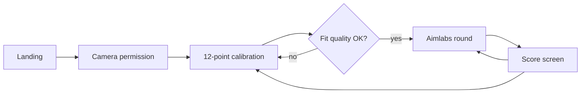
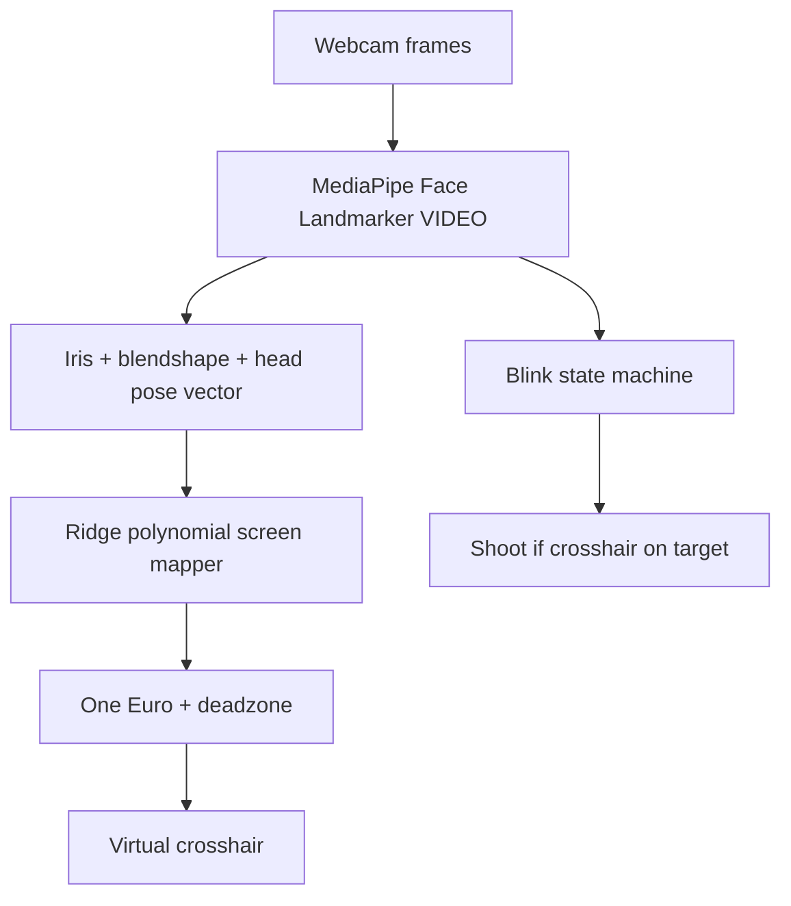

# Eye-Tracking Cursor + Aimlabs Demo

Webcam gaze → calibrated on-screen crosshair → blink to shoot. The **demo is a browser app** (Vite + React + TypeScript, all client-side). Browsers cannot move the OS mouse, so the cursor is a **virtual overlay inside the window**.

Python under `eye_tracking/` is the working MediaPipe prototype (iris, EAR, blinks, head pose, 9-point polynomial). Port those feature formulas into TS; do not keep OpenCV as the demo path.

## Demo in one sentence

Sit ~50–80 cm from a laptop, calibrate by blinking at 12 dots, then clear Gridshot targets with your eyes.

## Already in the repo

| Piece | Status | Use in the web app |
| --- | --- | --- |
| [`eye_tracking/tracker.py`](eye_tracking/tracker.py) | Done | Port iris gaze, blendshape fusion, blink hysteresis, Euler-from-matrix |
| [`eye_tracking/constants.py`](eye_tracking/constants.py) | Done | Same landmark indices and blink thresholds |
| [`models/face_landmarker.task`](models/face_landmarker.task) | Downloaded | Copy into `public/models/` as CDN fallback |
| OpenCV HUD (`python main.py`) | Lab harness | Keep for algorithm debugging; not the judged demo |

## User flow



1. **Landing** — one-line pitch, lighting hint, **Start**.
2. **Camera** — `getUserMedia({ video: { facingMode: "user", width: 1280, height: 720 } })`. Deny → retry copy, no blank screen.
3. **Calibration** — 12 targets, one at a time. Look + **blink** to lock (dwell 0.8s as backup). Tiny mirrored webcam + face-found light stays in the corner.
4. **Quality gate** — if mean residual > ~8% of min(viewport w, h), offer **Retry**.
5. **Game** — gaze moves the crosshair; blink shoots.
6. **Results** — score, accuracy, avg reaction, combo max; **Replay** or **Recalibrate**.

Single-page machine in `App.tsx`: `landing → camera → calibrate → playing → results`.

## Gaze pipeline



### MediaPipe

- Package: `@mediapipe/tasks-vision`
- Model: Face Landmarker float16 (478 landmarks, blendshapes, facial matrix)
- Mode: `VIDEO` via `detectForVideo(video, timestampMs)` inside `requestAnimationFrame`
- WASM/model: jsDelivr CDN first, `public/models/face_landmarker.task` if CDN fails
- Mirror the preview with CSS; **do not flip landmark x** if the video element is already mirrored visually — pick one convention and stick to it (preview mirrored, compute on the unmirrored frame, then `gx' = 1 - gx` for screen space)

### Per-frame features

Reuse the Python indices (anatomical left/right):

| Signal | Left (person) | Right (person) |
| --- | --- | --- |
| Inner / outer corner | 362 / 263 | 133 / 33 |
| Upper / lower lid | 386 / 374 | 159 / 145 |
| Iris center | 473 | 468 |
| Iris ring | 474–477 | 469–472 |
| Blink blendshape | `eyeBlinkLeft` | `eyeBlinkRight` |

**Iris gaze (per eye, 0–1 in eye space):**

```
gx = (iris.x - min(inner.x, outer.x)) / (abs(outer.x - inner.x) + eps)
gy = (iris.y - min(upper.y, lower.y)) / (abs(lower.y - upper.y) + eps)
```

Average both eyes. Fuse **0.65 iris + 0.35 blendshape look** (`eyeLookIn/Out/Up/Down` left/right), same mix as [`EyeTracker.update`](eye_tracking/tracker.py).

**Head pose:** 4×4 facial transform → pitch / yaw / roll (degrees). Include yaw and pitch in the mapper so small head motion does not throw the cursor.

**Feature vector `φ` (length 8):**

```
[1, gx, gy, gx², gy², gx·gy, yaw/45, pitch/30]
```

Yaw/pitch scaled so they sit on a similar range to gaze.

Hold last good vector if the face drops for < 200ms; after that freeze the cursor and show **Face not found**.

## Calibration

**12-point 4×3 grid** (normalized viewport, inset so laptop bezels / camera housing do not steal corners):

```
(0.10, 0.12) (0.37, 0.12) (0.63, 0.12) (0.90, 0.12)
(0.10, 0.50) (0.37, 0.50) (0.63, 0.50) (0.90, 0.50)
(0.10, 0.88) (0.37, 0.88) (0.63, 0.88) (0.90, 0.88)
```

Per point:

1. Pulse the dot; require face + both irises.
2. On blink (or 0.8s dwell), record **25 frames** of `φ` paired with that `(sx, sy)` in **viewport pixels**.
3. Reject the point if face/iris missing during the buffer; flash and retry that point.
4. Progress `1/12 … 12/12`.

**Fit:** two independent ridge regressions (x and y):

```
(ΦᵀΦ + λI) w = Φᵀ t    with λ ≈ 1e-2,  I[0,0] = 0  (do not shrink the intercept)
```

Predict `screen = (clamp(φ·w_x, 0, W), clamp(φ·w_y, 0, H))`. Refit only on calibration end (and on window resize: scale stored targets to the new viewport, or ask to recalibrate if size changed > 10%).

**Persist** `{ wX, wY, viewport, savedAt }` in `sessionStorage` under `vinhack-gaze-v1`. Skip calibration on refresh unless the user clicks Recalibrate or the quality gate fails.

**Quality:** mean Euclidean residual of sample means vs targets. Good < 6% of min(W,H); warn 6–8%; retry above that.

Keep the sitter **50–80 cm** away, face lit from the front, head mostly still. Show that on the landing and calibration chrome.

## Cursor and blink

**One Euro filter** on mapped x and y separately ([Casiez et al.](https://gery.casiez.net/1euro/)):

- `minCutoff = 1.0`
- `beta = 0.007`
- `dCutoff = 1.0`

Then a **4px deadzone** around the last published point so the reticle does not shimmer on a target.

**Blink-to-click** (port of Python hysteresis):

| Constant | Value |
| --- | --- |
| Close if both `eyeBlink*` ≥ | 0.45 **or** EAR ≤ 0.18 |
| Re-open if both blink < | 0.28 **and** EAR > 0.22 |
| Confirm after | 2–4 consecutive closed frames (~50–80ms) |
| Ignore if closed longer than | 400ms (squint / look-down) |
| Cooldown after a shot | 500ms |

Blink also confirms calibration points. Optional debug: hold `Shift` to shoot with the mouse.

## Gridshot (MVP)

Dark full-screen playfield. 30 seconds. **3 targets** live at once.

| Rule | Detail |
| --- | --- |
| Spawn | Random position, margin 80px, min 160px from other targets |
| Size | 56px radius visual; **hit radius 64px** (webcam gaze is centimeters off) |
| Lifetime | 1800ms, then timeout miss |
| Hit | Blink while filtered crosshair is inside hit radius |
| Miss blink | Blink while not on a target → combo reset |
| Score | `100 * combo` per hit; combo +1 on hit, 0 on miss/timeout |
| HUD | time, score, accuracy `hits / (hits+misses+timeouts)`, combo |
| End | score, accuracy, avg RT (spawn→hit), max combo, shots fired |

Mouse fallback (`F`) only for judging if tracking dies mid-demo — hide that in the HUD unless debug is on.

Stretch if time: **Tracking** mode (one mover, dwell 300ms or blink).

## UI

Aimlabs-adjacent: near-black `#0b0d10`, neon target `#3dff7a`, thin white crosshair with a 2px gap at center, IBM Plex / Inter. No component library.

- Landing: title, 3-step strip (calibrate → aim → blink), Start
- Calibration: one large pulsing disc, `n/12`, webcam pip
- Play: canvas or absolutely positioned targets; cursor is a DOM overlay so it stays sharp
- Results: big score, three stats, Replay / Recalibrate
- `D` toggles debug (mesh, raw gx/gy, blink score, residual)

## App structure

```
src/
  main.tsx, App.tsx, index.css
  lib/
    faceLandmarker.ts     # FilesetResolver + detectForVideo
    gazeFeatures.ts       # port of tracker.py feature math
    calibrationFit.ts     # ridge solve + predict + residual
    oneEuro.ts
    blink.ts              # hysteresis + cooldown
    storage.ts            # sessionStorage schema
  hooks/
    useCamera.ts
    useEyeTracker.ts      # rAF → features, cursor px, blink events
  components/
    Landing.tsx
    CameraGate.tsx
    CalibrationView.tsx
    GazeCursor.tsx
    AimGame.tsx
    Results.tsx
    DebugOverlay.tsx
    WebcamPip.tsx
public/
  models/face_landmarker.task
```

Keep `eye_tracking/` as the Python lab app; do not mix it into the Vite graph.

## Types (contract)

```ts
type GazeFeatures = {
  gx: number; gy: number;
  yaw: number; pitch: number;
  ear: number;
  blinkL: number; blinkR: number;
  faceFound: boolean;
};

type CalibModel = {
  wX: number[]; wY: number[];
  viewport: { w: number; h: number };
};

type TrackerFrame = {
  features: GazeFeatures;
  screen: { x: number; y: number } | null; // null until calibrated
  blinkPulse: boolean;                     // one-shot rising edge
};
```

`useEyeTracker` owns MediaPipe, rAF, filter, blink machine. Views only consume `TrackerFrame`.

## Demo robustness

- HTTPS or `localhost` for the webcam
- Face lost → freeze cursor + banner; do not let the reticle drift
- Recalibrate always on screen (corner link)
- If MediaPipe init fails: error with “refresh / use Chrome” — Chromium first for the demo
- Preload WASM + model on the landing so calibration does not stall
- Cap processing to video frame timestamps (`lastVideoTime`) so we do not run inference twice on the same frame
- Prefer 720p@30; drop debug mesh if FPS < 20

## Out of scope

- Moving the real OS mouse
- Tobii / hardware trackers
- Accounts, backend, multiplayer
- Pixel-perfect aim (webcam cannot do this)

## Build order

Each step should be demoable before the next.

1. **Scaffold + camera** — full-screen shell, permission, mirrored pip. *Accept:* webcam image, no console errors.
2. **Tracker** — landmarks + iris dots + raw gx/gy debug. *Accept:* looking left/right moves a raw dot the right way.
3. **Calibration mapper** — 12 dots, ridge fit, mapped cursor. *Accept:* looking at corners parks the cursor near those corners.
4. **One Euro + blink** — stable reticle, blink logs a click. *Accept:* blink does not fire twice; squint does not spray clicks.
5. **Gridshot + results** — 30s round, HUD, replay. *Accept:* three targets, score increments on blink-hit.
6. **Polish** — D overlay, face-lost, mouse fallback, model backup, landing copy.

Do not start the game until step 3 feels fair. A pretty Gridshot with a drunk cursor loses the demo.
