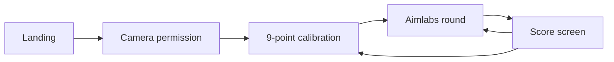
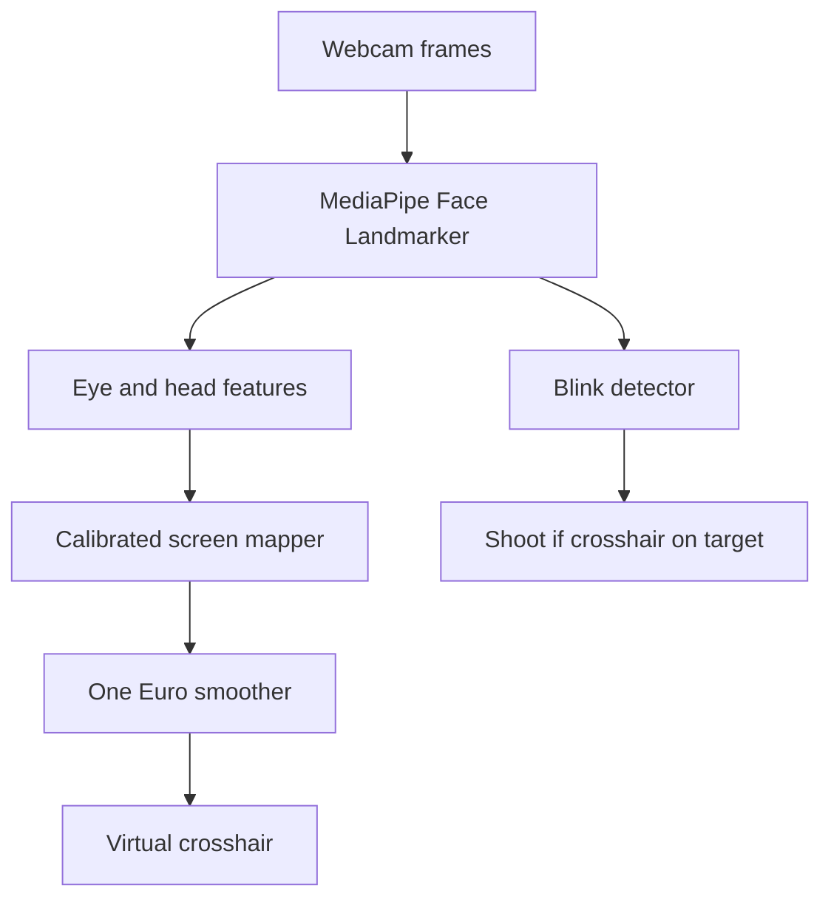

# Eye-Tracking Cursor + Aimlabs Demo

Greenfield repo ([README.md](README.md) only). Stack: **Vite + React + TypeScript**, all client-side. No backend. MediaPipe Face Landmarker runs in the browser on the laptop webcam.

A web app is the right fit: `getUserMedia`, a playable canvas game, and no OS-level mouse permission. The cursor is a **virtual overlay inside the app** (browsers cannot move the real system pointer).

## User flow




1. Landing: short pitch, **Start**, camera permission.
2. Calibration: look at each target; blink (or dwell) to lock a sample.12 point calibration. 
3. Game: gaze moves the crosshair; blink shoots.
4. Results: score, accuracy, avg reaction time; **Replay** or **Recalibrate**.

## Gaze pipeline




**Tracking:** `@mediapipe/tasks-vision` Face Landmarker (VIDEO mode, 478 landmarks + blendshapes).

**Per-frame features** (this is the “normalize looking across the laptop” step):

- Iris center vs eye corners, both eyes, averaged:
  - Horizontal: iris between inner/outer corners (`33/133`, `362/263`; iris centers `468`, `473`)
  - Vertical: iris between eyelid landmarks
- Head pose from the facial transformation matrix (yaw/pitch) so small head movement does not dump the cursor
- Optional blendshapes (`eyeLookIn/Out/Up/Down`) as extra regressor inputs

Raw iris offset is in **eye space** (roughly 0–1). Calibration turns that into **screen pixels**.

**Mapping:** after calibration, fit two ridge regressions (x and y), 2nd-order polynomial:

`screen = w0 + w1*gx + w2*gy + w3*gx^2 + w4*gy^2 + w5*gx*gy + w6*yaw + w7*pitch`

Store weights in `sessionStorage` so refresh can skip recalibration until the user moves.

**Smoothing:** [One Euro filter](https://gery.casiez.net/1euro/) on the mapped point (better than a plain moving average for noisy gaze). Small deadzone so the crosshair does not jitter on a target.

**Blink-to-click:** MediaPipe blendshapes `eyeBlinkLeft` / `eyeBlinkRight` both above ~0.45 for 2–4 frames, then a ~500ms cooldown. Ignore long closes. Blink is also used to **confirm each calibration point**.

## Calibration UI

12-point grid (corners, edge midpoints, center). One point at a time, full-screen, high contrast.

- Point pulses; user looks at it and blinks
- Record ~20–30 frames of features + that screen coordinate (captures micro-jitter, not one noisy sample)
- Progress 1/9 … 9/9; reject a point if face/iris is missing
- Quality check: if residual error is high, offer **retry** before the game

Keep the user ~50–80cm from the screen, face lit, head mostly still. Show a tiny mirrored webcam with a face-found indicator.

## Aimlabs-style game

Canvas (or absolutely positioned DOM targets) on a dark full-screen playfield. Virtual crosshair follows filtered gaze; it does not use the OS mouse except as a fallback debug toggle.

**MVP mode — Gridshot (30s):**

- 3 targets on screen at once
- Blink while the crosshair is inside a target = hit (score + combo)
- Miss blink = miss (combo reset)
- Target times out = miss
- HUD: time, score, accuracy, combo
- End screen with stats

Keep hit radius slightly generous (~48–72px). Webcam gaze is typically a few cm off, not pixel-perfect; the game should feel fair after a good calibration.

Optional if time: a second **Tracking** mode (one moving target, dwell or blink).

## App structure

```
src/
  main.tsx, App.tsx, index.css
  lib/
    faceLandmarker.ts    # load model, per-frame landmarks + blendshapes
    gazeFeatures.ts      # iris/eye/head vector
    calibrationFit.ts    # ridge/polynomial fit + predict
    oneEuro.ts           # smoother
    blink.ts             # blink state machine
  hooks/
    useCamera.ts
    useEyeTracker.ts     # rAF loop → features, cursor, blink events
  components/
    Landing.tsx
    CameraGate.tsx
    CalibrationView.tsx
    GazeCursor.tsx
    AimGame.tsx
    Results.tsx
    DebugOverlay.tsx     # webcam + landmarks, toggle with D
```

Single-page state machine in `App.tsx`: `landing → camera → calibrate → playing → results`.

Styling: dark Aimlabs-like (near-black, neon targets, thin crosshair). No component library required.

## Demo robustness

- HTTPS or `localhost` required for the webcam
- If the face is lost: freeze the cursor, show “Face not found”
- `D` toggles debug overlay (landmarks, raw gaze, EAR/blink value)
- Mouse fallback for judging the game if tracking dies mid-demo
- Recalibrate button always available
- Load the MediaPipe WASM/model from CDN with a local copy as backup if the network is bad on stage

## Out of scope (unless extra time)

- Moving the real OS mouse
- Tobii / hardware eye trackers
- Multiplayer, accounts, backend
- Perfect pixel aiming (webcam cannot do this)

## Implementation order

Build in this order so each step is demoable: camera + face mesh → raw iris cursor → calibration mapper → blink → game → polish.